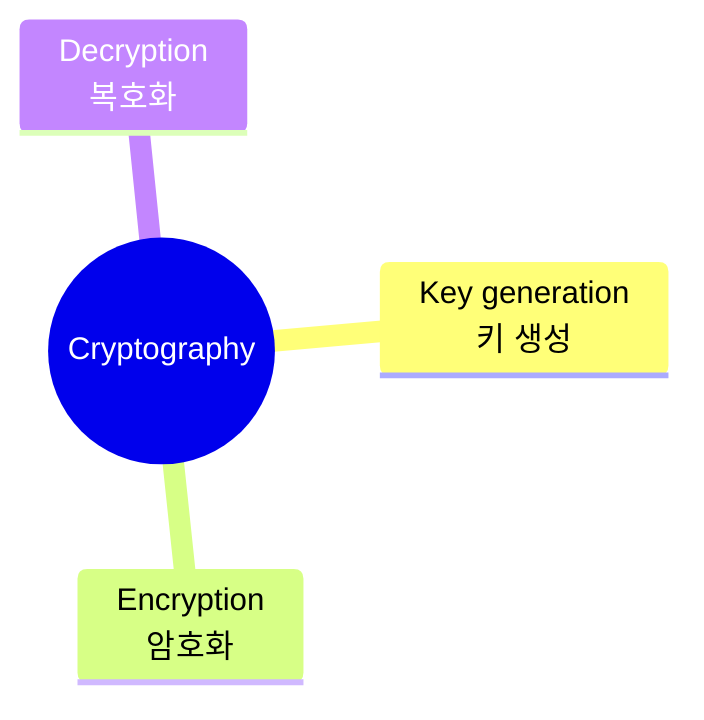
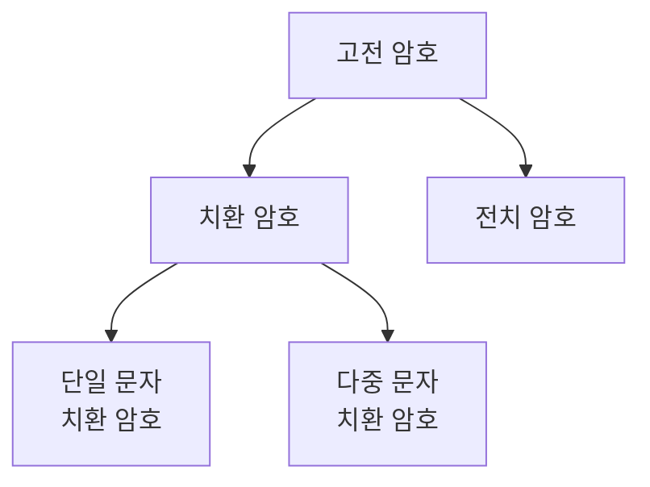

## 📝 Table <br>
[*1. Basics*](#basics)


# Basics
### ```Cryptography```<sub>: 정보 보호의 핵심 🔑</sub>

* key generation: 암호화 및 복호화에 사용되는 키를 생성
* encryption: 생성된 키를 이용해 **평문**을 **암호문**으로 변환 (↔ decryption)
* 암호 시스템: 암호화가 복호화로 정보가 전달되는 체계
<pre>cf. encoding: 데이터를 다른 형태로 변환 O, 기밀성 고려 X</pre>

### ```배타적 논리합 XOR```
* 두 인자가 **서로 다를 때**, **참**을 반환하는 연산
  * 값이 다르면 ```1```, 같으면 ```0``` 출력
* 예시 --> 5 ⊕ 7=101<sub>2</sub> ⊕ 111<sub>2</sub> = 010<sub>2</sub> = 2

  |값|이|진|표|현|
  |:---:|:---:|:---:|:---:|:---:|
  |```5```|0|1|0|1|
  |```7```|0|1|1|1|
  |```결과```|0|0|1|0|

### ```합동식```
* 두 정수 a, b를 각각 정수 m으로 나눴을 때 **나머지가 같은지**를 판별하는 식
* 'a와 b가 mod m에 대해 합동이다'
* 합동일 경우, 나누기를 제외한 같은 수 더하기/빼기/곱하기를 진행 시 여전히 합동
  <p align="center"></p>

* 곱셈의 역원
  * 정수 a, m에 대해 a×b=1(mod m)을 만족하는 ```b```를 ```mod m에 대한 a의 곱의 역원```이라고 부름
  * b는 <code>a<sup>-1</sup></code>로 표기될 수 있음
  * 역원은 a와 m이 **서로소**일 때만 존재!

<p align="right">ꉂ☺ᵎᵎᵎ</p>

### ```고전 암호```


* 대칭키 암호 시스템: 송신자와 수신자가 같은 키를 공유해야하는 암호 시스템

* 단일 문자 치환 암호: 약속된 바에 따라 평문의 문자를 다른 문자로 치환
  * 치환의 대응 관계는 **일대일 대응**
  * e.g. ```카이사르 암호```: 평문의 각 알파벳을 일정한 거리만큼 밀어서 치환
    * 이때 **알파벳을 밀어낸 횟수**를 ```키key```라고 함 --> 키 공간이 작은 편 (26)
    * 키 공간: 가능한 모든 키의 집합

* 다중 문자 치환 암호: 평문의 한 문자가 여러 종류의 문자로 치환될 수 있음
  * e.g. ```비네제르 암호```: 표를 이용한 암호화
    <br>
    
    <pre>C<sub>i</sub> = E<sub>k</sub>(M<sub>i</sub>) = (M<sub>i</sub> + K<sub>i</sub>) mod 26<br>M<sub>i</sub> = D<sub>k</sub>(C<sub>i</sub>) = (C<sub>i</sub> - K<sub>i</sub>) mod 26<br><br><i>C: 암호문, M: 평문, K: 키워드, X<sub>i</sub>: X의 i번째 요소</i></pre>

* 전치 암호: 정해진 길이만큼 평문 문자들의 **순서를 재배열**
  * e.g. ```스키테일 암호```: 나무봉 이용 --> 같은 나무봉을 가진 사람들만 해석 가능 (키: 나무봉)
 
#### 고전 암호 공격 유형
* ```전수 키 탐색 공격```: 평문과 암호문을 아는 상황에서, 키 공간을 전부 탐색하면서 키를 찾는 방법
* ```빈도수 공격```: 단일 치환 암호의 경우 일대일 대응이기 때문에 평문의 통계적 특성이 유지되므로 대상 언어의 특성으로 파악 (알파벳 사용 빈도)


<p align="right">ꉂ☺ᵎᵎᵎ</p>

### ```현대 암호```
* 대칭키 암호 시스템 --> 키 공유 과정 반드시 필요 --> 도청에 취약한 네트워크 --> 보완 필요
* 키 공유 알고리즘: 외부인이 키가 공유되는 과정은 도청하더라도, **공유되는 키는 알지 못하도록** 함
  * e.g. [```Diffie-Hellman 키 교환 알고리즘```](https://ko.wikipedia.org/wiki/%EB%94%94%ED%94%BC-%ED%97%AC%EB%A8%BC_%ED%82%A4_%EA%B5%90%ED%99%98) --> 공개키 암호 시스템 (or 비대칭키 암호 시스템) 창안

### 안전한 암호 🤔
* 현대 암호 시스템의 공통적 성질
  * 혼돈: 암호문에서 평문의 특성을 파악하기 쉽지 않음 --> 단일 치환 암호 미해당
  * 확산: 평문의 작은 변화로 인한 암호문의 큰 변화 --> 대부분 고전 암호 미해당
 
### ```대칭키 암호 시스템```
* 블록 암호: 평문을 **정해진 크기의 블록 단위로 암호화**하는 암호
  * e.g. [DES](https://ko.wikipedia.org/wiki/%EB%8D%B0%EC%9D%B4%ED%84%B0_%EC%95%94%ED%98%B8%ED%99%94_%ED%91%9C%EC%A4%80), [AES](https://ko.wikipedia.org/wiki/%EA%B3%A0%EA%B8%89_%EC%95%94%ED%98%B8%ED%99%94_%ED%91%9C%EC%A4%80)
  * 평문의 크기가 블록 크기의 배수가 아니라면? ***패딩*** 수행!
<p align="right"><sup>패딩: 평문이 블록 크기의 배수가 될 때까지 데이터를 추가함</sup></p>

* 스트림 암호: 송수신자 공유 데이터 스트림 생성 후 이를 평문에 XOR하는 암호
  * 암호문 C 생성식
  
    <pre>C = P ⊕ X<br><br><i>P: 평문, C: 암호문, X: 스트림</i></pre>

  * Seed: 스트림 공유 대신, 시드라 불리는 작은 값을 공유하고 이를 합의된 함수의 **인자**로 넣어 **스트림 각자 생성**
