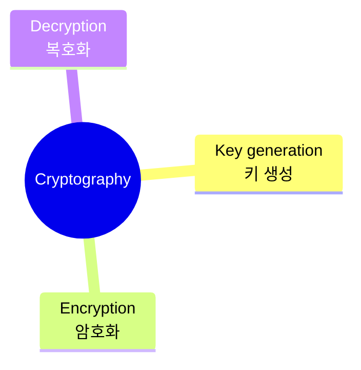

## 📝 Table <br>
[*1. Basics*](#basics)


# Basics
### ```Cryptography```<sub>: 정보 보호의 핵심 🔑</sub>

* key generation: 암호화 및 복호화에 사용되는 키를 생성
* encryption: 생성된 키를 이용해 **평문**을 **암호문**으로 변환 (↔ decryption)
* 암호 시스템: 암호화가 복호화로 정보가 전달되는 체계
<pre>cf. encoding: 데이터를 다른 형태로 변환 O, 기밀성 고려 X</pre>
