## 📝 Table <br>
[*1. Basics*](#basics)


# Basics

```mermaid
mindmap
  root((Cryptography))
    Key generation<br>키 생성
    Encryption<br>암호화
    Decryption<br>복호화
```

### ```Cryptography```<sub>: 정보 보호의 핵심 🔑</sub>

* key generation: 암호화 및 복호화에 사용되는 키를 생성
* encryption: 생성된 키를 이용해 **평문**을 **암호문**으로 변환 (↔ decryption)
* 암호 시스템: 암호화가 복호화로 정보가 전달되는 체계
<pre>cf. encoding: 데이터를 다른 형태로 변환 O, 기밀성 고려 X</pre>

### ```배타적 논리합 XOR```
* 두 인자가 **서로 다를 때**, **참**을 반환하는 연산
  * 값이 다르면 ```1```, 같으면 ```0``` 출력
* 예시 --> 5 ⊕ 7=101<sub>2</sub> ⊕ 111<sub>2</sub> = 010<sub>2</sub> = 2

  |값|이|진|표|현|
  |:---:|:---:|:---:|:---:|:---:|
  |```5```|0|1|0|1|
  |```7```|0|1|1|1|
  |```결과```|0|0|1|0|
