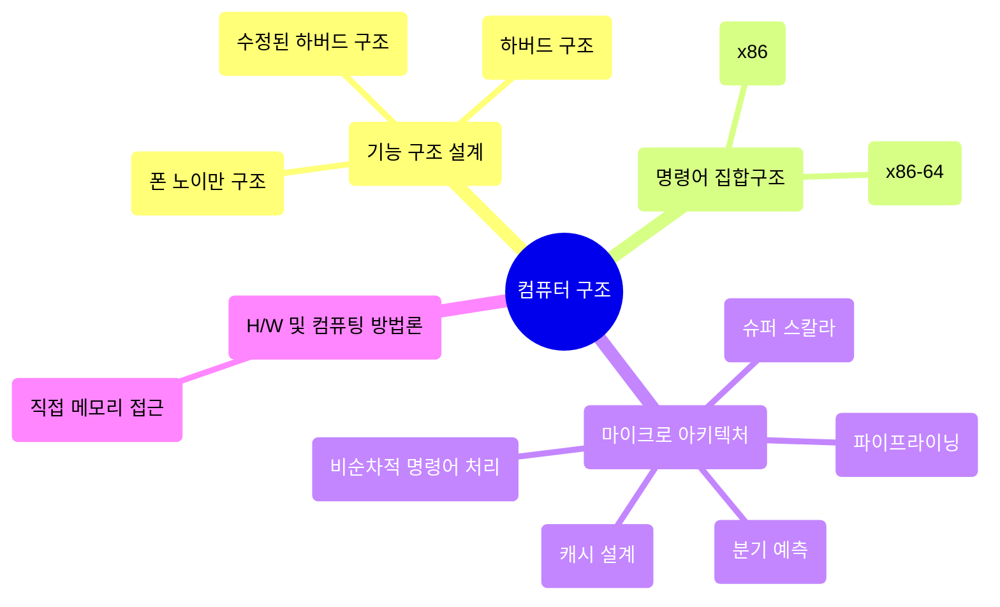

## 📝 Table <br>
[*1. Basics*](#basics)


# Basics

<details>
<summary>예시 코드 이해하기</summary>
<div markdown="1">
<br>

<code>👾 "Welcome Hackers :)" 가 출력되는 입력값 찾아보기</code>
```solve_me.c
#include <stdio.h>
#include <stdlib.h>
#include <string.h>
int main() {
  int sz = 0x30;
  char *buf = (char *)malloc(sizeof(char) * sz); //메모리 할당
  puts("Hello World!");
  printf("Education + Hack = ? ");
  fgets(buf, sz, stdin);
  if (!strncmp(buf, "DreamHack", 9))
    printf("Welcome Hackers :)\n");
  else
    printf("No No :/\n");
  return 0;
}
```
* ```malloc 함수```<sup>memory allocation</sup>: 요청한 크기의 메모리를 동적으로 할당하여 리턴
  * ```#include <stdlib.h>``` 헤더파일 명령어 필요
  * C언어는!!! 동적으로 size를 결정할 때 malloc 함수가 꼭 필요함!
  * void형 포인터를 리턴하기 때문에 데이터 타입의 종류는 알 수 없음<br>
    --> void 포인터를 반환하고 변환하여 사용할 수 있음
* ```메모리를 동적 할당한다```: 런타임 도중 사용할 메모리 공간을 할당
  * 메모리는 힙 영역에 생성됨 cf) 정적 메모리 할당<sup>데이터, 스택 영역</sup>: 컴파일 타임에 메모리 크기 결정
* ```strncmp 함수```: 두 문자열을 비교하여 같으면 0, 다르면 음수or양수 리턴
  * **strncmp(str1, str2, n)**
    * 맨 앞 두 매개변수 --> 비교할 두 문자열
    * 세 번째 매개변수 n --> 비교할 문자열 길이
    * n > 0이어야하며, 두 문자열 중 더 적은 것을 기준으로 비교
  * ```#include <string.h>``` 헤더파일 명령어 필요

```solve_me.py
#!/usr/bin/python3
quiz = [116, 66, 85, 81, 93, 120, 81, 83, 91]
for i in range(len(quiz)):
    quiz[i] ^= 0x30
quiz = ''.join([chr(_) for _ in quiz])
answer = input()
if answer == quiz:
    print("Welcome Hackers :)")
else:
    print("No No :/")
```
* ```chr() 함수```: 정수를 인자로 받으며, 해당 정수를 아스키코드로 바꾸어줌
* ```^```은 XOR 연산자로, quiz 리스트의 인덱스별 값을 바꿈
 
</details>

### ```컴퓨터 구조```<sup>Computer Architecture</sup>
<p align="center"></p>

<p align="right">ꉂ☺ᵎᵎᵎ</p>

### ```명령어 집합구조```<sup>ISA, Instruction Set Architecture</sup>
* 마이크로프로세서가 인식해서 기능을 이해하고 실행할 수 있는 기계어 명령어와 관련된 설계
  * 마이크로프로세서 = CPU = 마이크로 아키텍처
  * CPU가 처리해야하는 명령어를 설계하는 분야
  * 비트를 나눠 의미를 부여함 [*어셈블리어*](https://ko.wikipedia.org/wiki/%EC%96%B4%EC%85%88%EB%B8%94%EB%A6%AC%EC%96%B4)
* ex) 인텔 - x86 || x86-64, ARM, MIPS, AVR



### ```폰 노이만 구조```
<p align="center"></p>


