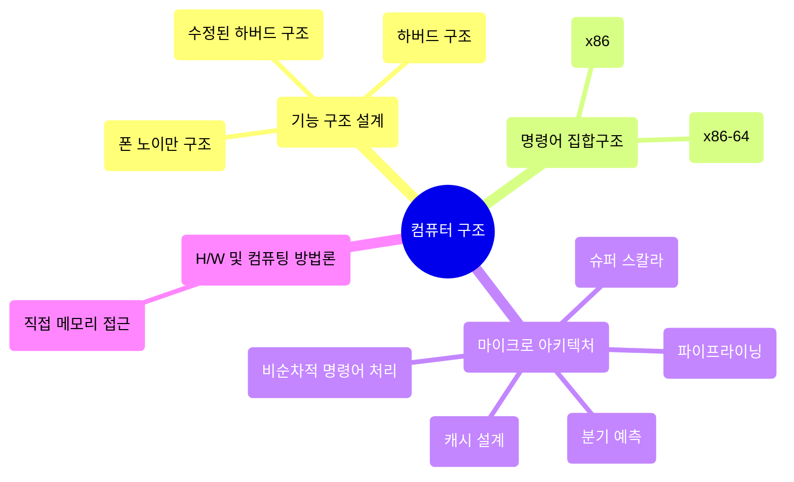

## 📝 Table <br>
[*1. Basics*](#basics)


# Basics

<details>
<summary>예시 코드 이해하기</summary>
<div markdown="1">
<br>

<code>👾 "Welcome Hackers :)" 가 출력되는 입력값 찾아보기</code>
```solve_me.c
#include <stdio.h>
#include <stdlib.h>
#include <string.h>
int main() {
  int sz = 0x30;
  char *buf = (char *)malloc(sizeof(char) * sz); //메모리 할당
  puts("Hello World!");
  printf("Education + Hack = ? ");
  fgets(buf, sz, stdin);
  if (!strncmp(buf, "DreamHack", 9))
    printf("Welcome Hackers :)\n");
  else
    printf("No No :/\n");
  return 0;
}
```
* ```malloc 함수```<sup>memory allocation</sup>: 요청한 크기의 메모리를 동적으로 할당하여 리턴
  * ```#include <stdlib.h>``` 헤더파일 명령어 필요
  * C언어는!!! 동적으로 size를 결정할 때 malloc 함수가 꼭 필요함!
  * void형 포인터를 리턴하기 때문에 데이터 타입의 종류는 알 수 없음<br>
    --> void 포인터를 반환하고 변환하여 사용할 수 있음
* ```메모리를 동적 할당한다```: 런타임 도중 사용할 메모리 공간을 할당
  * 메모리는 힙 영역에 생성됨 cf) 정적 메모리 할당<sup>데이터, 스택 영역</sup>: 컴파일 타임에 메모리 크기 결정
* ```strncmp 함수```: 두 문자열을 비교하여 같으면 0, 다르면 음수or양수 리턴
  * **strncmp(str1, str2, n)**
    * 맨 앞 두 매개변수 --> 비교할 두 문자열
    * 세 번째 매개변수 n --> 비교할 문자열 길이
    * n > 0이어야하며, 두 문자열 중 더 적은 것을 기준으로 비교
  * ```#include <string.h>``` 헤더파일 명령어 필요

```solve_me.py
#!/usr/bin/python3
quiz = [116, 66, 85, 81, 93, 120, 81, 83, 91]
for i in range(len(quiz)):
    quiz[i] ^= 0x30
quiz = ''.join([chr(_) for _ in quiz])
answer = input()
if answer == quiz:
    print("Welcome Hackers :)")
else:
    print("No No :/")
```
* ```chr() 함수```: 정수를 인자로 받으며, 해당 정수를 아스키코드로 바꾸어줌
* ```^```은 XOR 연산자로, quiz 리스트의 인덱스별 값을 바꿈
 
</details>

### ```컴퓨터 구조```<sup>Computer Architecture</sup>
<p align="center"></p>

<p align="right">ꉂ☺ᵎᵎᵎ</p>

### ```명령어 집합구조```<sup>ISA, Instruction Set Architecture</sup>
* 마이크로프로세서가 인식해서 기능을 이해하고 실행할 수 있는 기계어 명령어와 관련된 설계
  * 마이크로프로세서 = CPU = 마이크로 아키텍처
  * CPU가 처리해야하는 명령어를 설계하는 분야
  * 비트를 나눠 의미를 부여함 [*어셈블리어*](https://ko.wikipedia.org/wiki/%EC%96%B4%EC%85%88%EB%B8%94%EB%A6%AC%EC%96%B4)
* ex) 인텔 - x86 || x86-64(amd64), ARM, MIPS, AVR



### ```폰 노이만 구조```
<p align="center"></p>
 
* ```CPU```
  * ALU<sup>Arithmetic Logic Unit</sup>: 산술/논리 연산 처리
  * CU<sup>Control Unit</sup>: CPU 제어
  * Register: 필요한 데이터 저장
  * Cache
    * 교환속도를 단축하기 위해 CPU 내부에 레지스터와 캐시 이 두 저장장치를 보유
* ```Memory```
  * 주기억장치 --> 프로그램 실행과정에서 필요한 데이터들을 **임시로** 저장<br>
    ex) RAM<sup>Random Access Memory</sup>, ROM<sup>Read Only Memory</sup><br>
      > RAM은 휘발성이며 읽고 쓰기가 가능함<br>
      > ROM은 비휘발성이며 읽기만 가능함
    * 보조기억장치에 비해 상대적으로 빠름
  * 보조기억장치 --> OS, 프로그램 등의 데이터를 **장기간** 저장<br>
    ex) HDD, SSD
      > HDD는 물리적으로 디스크를 고속으로 회전시켜 데이터를 저장함<br>
      > SSD는 전기적으로 데이터를 저장하기 때문에, 속도가 HDD에 비해 훨등히 빠름
* ```Bus```: 컴퓨터 부품-부품 또는 컴퓨터-컴퓨터 사이에 신호를 전송하는 통로<br>
  ex) Data Bus, Address Bus, Control Bus, 랜선, 데이터 전송 S/W, 프로토콜, etc.

<p align="right">ꉂ☺ᵎᵎᵎ</p>

### ```x86-64 아키텍처```
* x86 명령어 집합 아키텍처의 64비트 모임 > CPU가 한번에 처리할 수 있는 데이터의 크기<sup>WORD</sup>가 64
<br>

* 레지스터
  * ```범용 레지스터```
    * amd64에서 각각 8바이트를 저장 > 부호 없는 정수 기준 2<sup>64</sup>-1까지의 수 표현 가능
    * 주 범용 레지스터
      
      |이름|주 용도|
      |:---|:---|
      |rax<sup>accumulator register</sup>|함수의 반환 값|
      |rbx<sup>base register</sup>|x64에서는 주된 용도 없음|
      |rcx<sup>counter register</sup>|반복문의 반복 횟수, 각종 연산의 시행 횟수|
      |rdx<sup>data register</sup>|x64에서는 주된 용도 없음|
      |rsi<sup>source index</sup>|데이터를 옮길 때 원본을 가리키는 포인터|
      |rdi<sup>destination index</sup>|데이터를 옮길 때 목적지를 가리키는 포인터|
      |rsp<sup>stack pointer</sup>|사용중인 스택의 위치를 가리키는 포인터|
      |rbp<sup>stack base pointer</sup>|스택의 바닥을 가리키는 포인터|
* 세그먼트 레지스터
  * 16비트
  * ex) cs, ss, ds -> 코드,데이터,스택 메모리 영역 가리킴 | es, fs, gs -> OS 별 용도 상이
* 명령어 포인터 레지스터: CPU가 실행할 코드 부분을 가리킴
  * 8바이트
  * ex) rip

### [```플래그 레지스터```](https://ko.wikipedia.org/wiki/%EC%83%81%ED%83%9C_%EB%A0%88%EC%A7%80%EC%8A%A4%ED%84%B0)
* 프로세서의 현재 상태를 저장하고 있는 레지스터
* 해당 레지스터를 구성하는 여러 비트들로 **CPU의 현재 상태를 표현**
* 64비트 -> 최대 64개 플래그 사용가능하지만 실제로 사용하는 건 **20여개**
* 주 플래그 레지스터
  |플래그|의미|
  |:---|:---|
  |CF<sup>Carry Flag</sup>|부호 없는 수의 연산 결과가 비트의 범위를 넘을 경우 설정됨|
  |ZF<sup>Zero Flag</sup>|연산의 결과가 0일 경우 설정됨|
  |SF<sup>Sign Flag</sup>|연산의 결과가 음수일 경우 설정됨|
  |OF<sup>Overflow Flag</sup>|부호 있는 수의 연산 결과가 비트 범위를 넘을 경우 설정됨|
* 사용 예시
  <pre>3의 값을 갖는 a와 5의 값을 갖는 b가 있을 때,<br>a에서 b를 빼는 연산을 하면, 연산의 결과가 음수이므로 SF가 설정됨<br><br>💡CPU는 SF를 통해 a가 b보다 작았음을 알 수 있음💡</pre>

### 레지스터 호환
<p align="center"></p>

* 64bit(8바이트) -> 32bit(4바이트) -> 16bit(2바이트) -> ah(high): 상위 8bit(1바이트) / al(low): 하위 8bit
* 과거의 아키텍처들과의 호환
* IA-32에서 사용되는 32비트의 레지스터들: eax, ebx, etc. -> x86-64와 호환

<p align="right">ꉂ☺ᵎᵎᵎ</p>

#### 메모리 오염: 공격자가 메모리를 악의적으로 조작하여 CPU도 잘못된 동작을 하게 만드는 것
* 취약점
  * Stack Buffer Overflow
  * Format String Bug
  * Use After Free
  * Double Free Bug

## 리눅스 프로세스의 메모리 구조
<p align="center"></p>
<br>

<pre>CPU는 실행할 명령어와 명령어 처리에 필요한 데이터를 <b>메모리</b>에서 읽고,<br>ISA에 따라 이를 처리한다. 그리고 연산의 결과를 다시 메모리에 적재한다.<br><br>✅CPU 🧑‍🤝‍🧑 메모리✅</pre>

### ```세그먼트```
* 프로세스의 메모리를 로드되는 데이터를 용도에 따라 구획으로 나눈 것
* 리눅스에서 프로세스의 메모리를 구분하는 기준 (5가지)
* OS가 용도에 맞게 적절한 권한 부여 가능 --> CPU는 부여받은 권한에 한해 행위
<br>

* ```코드 세그먼트```: 실행 가능한 기계 코드가 위치하는 영역 <sup>=Text Segment</sup>
  * 읽기 권한, 실행 권한
* ```데이터 세그먼트```: 컴파일 시점에 값이 정해진 전역 변수 및 전역 상수가 위치하는 영역
  * 프로그램 실행 시 사용하는 데이터 적재
  * 읽기 권한 (CPU가 해당 데이터를 읽을 수 있도록)
  * **쓰기 권한**에 따른 데이터 세그먼트 분류
    * ***data 세그먼트***
      * 쓰기가 가능한 세그먼트
      * 프로그램이 실행되면서 값이 변할 수 있는<sup>ex) 전역 변수</sup>데이터들이 위치
    * ***rodata 세그먼트***: read-only data
      * 쓰기가 불가능한 세그먼트
      * 프로그램이 실행되면서 값이 변하면 안되는<sup>ex) 전역 상수수</sup>데이터들이 위치
* ```BSS 세그먼트```<sup>Block Started By Symbol Segment</sup>: 컴파일 시점에 값이 정해지지 않은 전역 변수가 위치하는 영역
  * 읽기 권한, 쓰기 권한
  * 선언만 하고 초기화하지 않은 전역변수 등 포함
  * 해당 세그먼트의 메모리 영역은 **프로그램이 시작될 때, 모두 0으로 초기화됨**
<br>

* ```스택 세그먼트```
  * 함수의 인자나 지역 변수 같은 임시 변수가 실행 중 저장됨
  * 읽기 권한, 쓰기 권한
  * 스택 프레임: 스택 세그먼트가 사용되는 단위
    * 함수가 호출될 때 생성되고, 반환될 때 해제됨
  * 스택 세그먼트의 크기는 원래 작았다가 부족해질 때마다 OS의 할당에 의해 확장됨
  * 스택 확장 시 기존 주소보다 낮은 주소로 확장됨
* ```힙 세그먼트```
  * malloc(), calloc() 등의 호출로 할당된 메모리가 위치
  * 읽기 권한, 쓰기 권한
* 힙과 스택의 진행 방향이 반대인 이유
  <pre>같은 방향으로 자라면, 확장하는 과정에서 충돌이 발생할 수 있기 때문</pre>

<details>
<summary>표로 정리하는 세그먼트</summary>
<div markdown="1">
<br>
  
|세그먼트|역할|일반적인 권한|사용 예시|
|:---|:---|:---|:---|
|코드 세그먼트|실행 가능한 코드가 저장된 영역|읽기, 실행|main() 등의 함수 코드|
|데이터 세그먼트|초기화된 전역 변수 또는 상수가 위치하는 영역|읽기와 쓰기 또는 읽기 전용|초기화된 전역 변수, 전역 상수|
|BSS 세그먼트|초기화되지 않은 데이터가 위치하는 영역|읽기, 쓰기|초기화되지 않은 전역 변수|
|스택 세그먼트|임시 변수가 저장되는 영역|읽기, 쓰기|지역 변수, 함수의 인자 등|
|힙 세그먼트|실행 중 동적으로 사용되는 영역|읽기, 쓰기|malloc(), calloc() 등으로 할당 받은 메모리|
</details>
