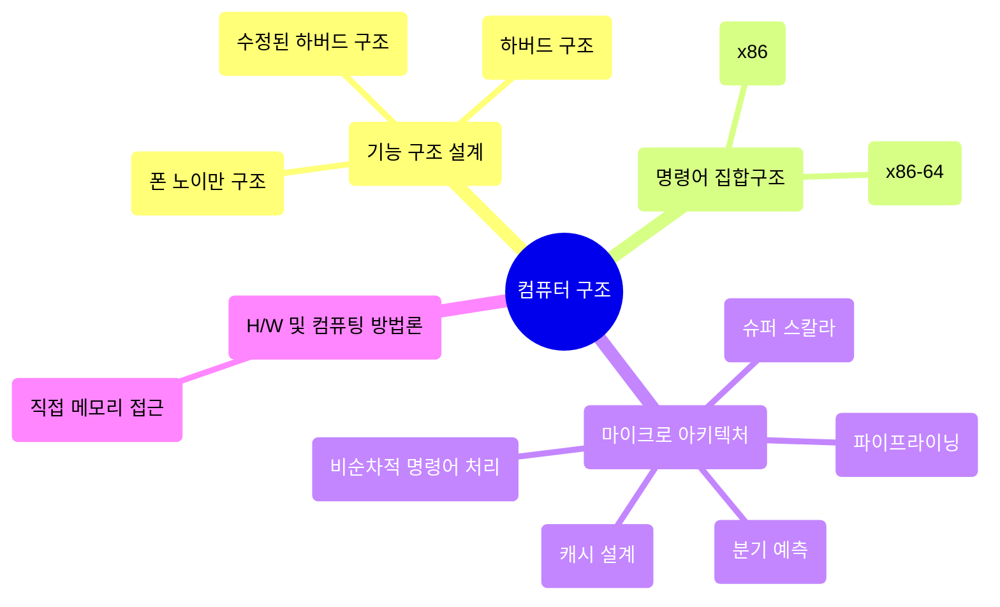

## 📝 Table <br>
[*1. Basics*](#basics)


# Basics

<details>
<summary>예시 코드 이해하기</summary>
<div markdown="1">
<br>

<code>👾 "Welcome Hackers :)" 가 출력되는 입력값 찾아보기</code>
```solve_me.c
#include <stdio.h>
#include <stdlib.h>
#include <string.h>
int main() {
  int sz = 0x30;
  char *buf = (char *)malloc(sizeof(char) * sz); //메모리 할당
  puts("Hello World!");
  printf("Education + Hack = ? ");
  fgets(buf, sz, stdin);
  if (!strncmp(buf, "DreamHack", 9))
    printf("Welcome Hackers :)\n");
  else
    printf("No No :/\n");
  return 0;
}
```
* ```malloc 함수```<sup>memory allocation</sup>: 요청한 크기의 메모리를 동적으로 할당하여 리턴
  * ```#include <stdlib.h>``` 헤더파일 명령어 필요
  * C언어는!!! 동적으로 size를 결정할 때 malloc 함수가 꼭 필요함!
  * void형 포인터를 리턴하기 때문에 데이터 타입의 종류는 알 수 없음<br>
    --> void 포인터를 반환하고 변환하여 사용할 수 있음
* ```메모리를 동적 할당한다```: 런타임 도중 사용할 메모리 공간을 할당
  * 메모리는 힙 영역에 생성됨 cf) 정적 메모리 할당<sup>데이터, 스택 영역</sup>: 컴파일 타임에 메모리 크기 결정
* ```strncmp 함수```: 두 문자열을 비교하여 같으면 0, 다르면 음수or양수 리턴
  * **strncmp(str1, str2, n)**
    * 맨 앞 두 매개변수 --> 비교할 두 문자열
    * 세 번째 매개변수 n --> 비교할 문자열 길이
    * n > 0이어야하며, 두 문자열 중 더 적은 것을 기준으로 비교
  * ```#include <string.h>``` 헤더파일 명령어 필요

```solve_me.py
#!/usr/bin/python3
quiz = [116, 66, 85, 81, 93, 120, 81, 83, 91]
for i in range(len(quiz)):
    quiz[i] ^= 0x30
quiz = ''.join([chr(_) for _ in quiz])
answer = input()
if answer == quiz:
    print("Welcome Hackers :)")
else:
    print("No No :/")
```
* ```chr() 함수```: 정수를 인자로 받으며, 해당 정수를 아스키코드로 바꾸어줌
* ```^```은 XOR 연산자로, quiz 리스트의 인덱스별 값을 바꿈
 
</details>

### ```컴퓨터 구조```<sup>Computer Architecture</sup>
<p align="center"></p>

<p align="right">ꉂ☺ᵎᵎᵎ</p>

### ```명령어 집합구조```<sup>ISA, Instruction Set Architecture</sup>
* 마이크로프로세서가 인식해서 기능을 이해하고 실행할 수 있는 기계어 명령어와 관련된 설계
  * 마이크로프로세서 = CPU = 마이크로 아키텍처
  * CPU가 처리해야하는 명령어를 설계하는 분야
  * 비트를 나눠 의미를 부여함 [*어셈블리어*](https://ko.wikipedia.org/wiki/%EC%96%B4%EC%85%88%EB%B8%94%EB%A6%AC%EC%96%B4)
* ex) 인텔 - x86 || x86-64(amd64), ARM, MIPS, AVR



### ```폰 노이만 구조```
<p align="center"></p>
 
* ```CPU```
  * ALU<sup>Arithmetic Logic Unit</sup>: 산술/논리 연산 처리
  * CU<sup>Control Unit</sup>: CPU 제어
  * Register: 필요한 데이터 저장
  * Cache
    * 교환속도를 단축하기 위해 CPU 내부에 레지스터와 캐시 이 두 저장장치를 보유
* ```Memory```
  * 주기억장치 --> 프로그램 실행과정에서 필요한 데이터들을 **임시로** 저장<br>
    ex) RAM<sup>Random Access Memory</sup>, ROM<sup>Read Only Memory</sup><br>
      > RAM은 휘발성이며 읽고 쓰기가 가능함<br>
      > ROM은 비휘발성이며 읽기만 가능함
    * 보조기억장치에 비해 상대적으로 빠름
  * 보조기억장치 --> OS, 프로그램 등의 데이터를 **장기간** 저장<br>
    ex) HDD, SSD
      > HDD는 물리적으로 디스크를 고속으로 회전시켜 데이터를 저장함<br>
      > SSD는 전기적으로 데이터를 저장하기 때문에, 속도가 HDD에 비해 훨등히 빠름
* ```Bus```: 컴퓨터 부품-부품 또는 컴퓨터-컴퓨터 사이에 신호를 전송하는 통로<br>
  ex) Data Bus, Address Bus, Control Bus, 랜선, 데이터 전송 S/W, 프로토콜, etc.

<p align="right">ꉂ☺ᵎᵎᵎ</p>

### ```x86-64 아키텍처```
* x86 명령어 집합 아키텍처의 64비트 모임 > CPU가 한번에 처리할 수 있는 데이터의 크기<sup>WORD</sup>가 64
<br>

* 레지스터
  * ```범용 레지스터```
    * amd64에서 각각 8바이트를 저장 > 부호 없는 정수 기준 2<sup>64</sup>-1까지의 수 표현 가능
    * well-known register
      
      |이름|주 용도|
      |:---|:---|
      |rax<sup>accumulator register</sup>|함수의 반환 값|
      |rbx<sup>base register</sup>|x64에서는 주된 용도 없음|
      |rcx<sup>counter register</sup>|반복문의 반복 횟수, 각종 연산의 시행 횟수|
      |rdx<sup>data register</sup>|x64에서는 주된 용도 없음|
      |rsi<sup>source index</sup>|데이터를 옮길 때 원본을 가리키는 포인터|
      |rdi<sup>destination index</sup>|데이터를 옮길 때 목적지를 가리키는 포인터|
      |rsp<sup>stack pointer</sup>|사용중인 스택의 위치를 가리키는 포인터|
      |rbp<sup>stack base pointer</sup>|스택의 바닥을 가리키는 포인터|


      
