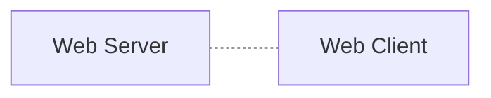

## 📝 Table <br>
[*1. Basics*](#basics)


# Basics

<details>
<summary>예시 코드 이해하기</summary>
<div markdown="1">
<br>

<code>👾 "Welcome Hackers :)" 가 출력되는 입력값 찾아보기</code>
```solve_me.c
#include <stdio.h>
#include <stdlib.h>
#include <string.h>
int main() {
  int sz = 0x30;
  char *buf = (char *)malloc(sizeof(char) * sz);
  puts("Hello World!");
  printf("Education + Hack = ?\\n");
  fgets(buf, sz, stdin); // 입력 받기
  if (!strncmp(buf, "DreamHack", 9))
    printf("Welcome Hackers :)\\n");
  else
    printf("No No :/n");
  return 0;
}
```
* ```malloc 함수```: 요청한 크기의 메모리를 동적으로 할당하여 리턴
  * ```#include <stdlib.h>``` 헤더파일 명령어 필요
* ```메모리를 동적 할당한다```: 런타임 도중 사용할 메모리 공간을 할당
  * 메모리는 힙 영역에 생성됨 cf) 정적 메모리 할당<sup>데이터, 스택 영역</sup>: 컴파일 타임에 메모리 크기 결정
* ```strncmp 함수```: 두 문자열을 비교하여 같으면 0, 다르면 음수or양수 리턴
  * **strncmp(str1, str2, n)**
    * 맨 앞 두 매개변수 --> 비교할 두 문자열
    * 세 번째 매개변수 n --> 비교할 문자열 길이
    * n > 0이어야하며, 두 문자열 중 더 적은 것을 기준으로 비교
  * ```#include <string.h>``` 헤더파일 명령어 필요

```solve_me.py
#!/usr/bin/python3
quiz = [116, 66, 85, 81, 93, 120, 81, 83, 91]
for i in range(len(quiz)):
    quiz[i] ^= 0x30
quiz = ''.join([chr(_) for _ in quiz])
answer = input()
if answer == quiz:
    print("Welcome Hackers :)")
else:
    print("No No :/")
```
 
</details>

### ```웹```
**WWW**라고 불리는 World Wide Web의 줄임말로,<br>인터넷을 기반으로 구현된 서비스 중 **HTTP를 이용하여 정보를 공유하는 서비스**.
> <b><i>wikipedia</i></b><br>
>
> an information system enabling information to be shared over the Internet through simplified ways meant to appeal to users beyond IT specialists and hobbyists, as well as documents and other web resources to be accessed over the Internet according to specific rules, the Hypertext Transfer Protocol (HTTP)
<br>


* 웹 클라이언트-서버 간 통신
  * (클라이언트) 이용자가 브라우저로 웹 서버 접속
  * (클라이언트) 브라우저가 요청 해석 후 HTTP 형식으로 웹 서버에 리소스 요청
  * (서버) HTTP 형식의 요청을 해석
  * (서버) 해석을 따라 적절한 동작 수행
  * (서버) 리소스를 HTTP 형식으로 이용자에게 전달
  * (클라이언트) 서버가 제공한 웹 리소스를 브라우저가 시각화

### ```웹 리소스```
* 고유 URI<sup><i>uniform resource identifier</i></sup> 보유
* HTML, CSS, JS, 문서, 이미지, 동영상, 폰트, etc.

### ```인코딩```
* 아스키 ; 7비트 데이터 인코딩 표준
* 유니코드 --> 인코딩이 호환되지 않는 문제를 해결하고자 탄생

### ```프로토콜```
* 약속 하에서 정보 교환에 오류가 없도록 하는 수단
* 데이터의 정확한 해석을 위한 문법*syntax*을 포함
> 네트워크 통신 기초 --> TCP/IP<br>
> 웹 애플리케이션 --> HTTP<br>
> 파일 공유 --> FTP

### ```HTTP```
* 서버와 클라이언트의 데이터 교환을 **요청**과 **응답** 형식으로 정의한 프로토콜
* HTTP 서버는 웹 서버에 의해 *HTTP 서비스 포트*에 대기
* 서비스 포트: 네트워크 포트 중 특정 서비스 점유가 점유하는 포트
* OSI 7 계층 中 [전송 계층](https://ko.wikipedia.org/wiki/%EC%A0%84%EC%86%A1_%EA%B3%84%EC%B8%B5) --> TCP, UDP, etc. // 인웹기
* 포트의 개수는 운영체제마다 다름
* Well-known port
  
  |서비스|포트 번호|
  |:---:|:---:|
  |SSH|22|
  |HTTP|80|
  |HTTPS|443|
  * 유명한 포트에서 서비스 실행 시 관리자 권한 요구됨 -> 클라이언트가 서비스 신뢰

### [```HTTP 상태코드```](https://www.rfc-editor.org/rfc/rfc2616.html#section-6)
|상태코드|설명|
|:---:|:---|
|1xx|요청 제대로 받았고, 처리 진행 중|
|2xx|요청 제대로 처리됨|
|3xx|요청을 처리하려면, 클라이언트의 추가 동작 필요|
|4xx|클라이언트의 잘못된 요청 전송으로 인한 처리 실패|
|5xx|유효한 클라이언트 요청에도 불구하고, 서버 에러로 인한 처리 실패|

### ```HTTPS``` <sup>HTTP with *security*</sup>
* TLS: 서버와 클라이언트 사이의 모든 HTTP 메시지를 암호화하는 프로토콜

<p align="right">ꉂ☺ᵎᵎᵎ</p>

### ```웹 브라우저```
* UX<sup>User eXperience</sup>을 제공하는 정말 조은 소프트웨어 ^_^
* 기본적인 동작 과정
  ```mermaid
  flowchart LR
  A[URL<br>분석] --> B;
  B[DNS<br>요청] --> C;
  C[HTTP를 통해<br>URL에 요청] --> D;
  D[URL의 HTTP 응답<br>수신] --> E;
  E[리소스 다운로드<br>&<Br>웹 렌더링]
  ```

### ```URL```
<p align="center"></p>

* scheme: 웹 서버와의 통신 프로토콜 종류
* host: 접속할 웹 서버 주소의 정보 (authority의 일부)
* port: 접속할 웹 서버 포트에 대한 정보 (authority의 일부)
* path: 접근할 웹 서버의 리소스 경로
  * ```/```로 구분
* query: 웹 서버에 전달할 파라미터
  * ```?``` 뒤
* fragment: 메인 리소스에 존재하는 **서브 리소스**를 접근할 때를 식별
  * ```#``` 뒤
<br>

* Host --> Domain Name, IP Address를 가짐
* 브라우저가 DNS에 Domain Name을 질의하고 DNS가 응답한 IP Address 사용

  ```mermaid
  flowchart LR
  A[IP Address] --> |DNS| B;
  B[Domain Name] --> |DNS| A;
  ```

### 


  
