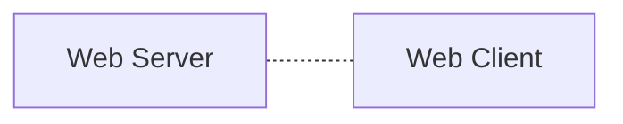

## 📝 Table <br>
[*1. Basics*](#basics)


# Basics
### ```웹```
**WWW**라고 불리는 World Wide Web의 줄임말로,<br>인터넷을 기반으로 구현된 서비스 중 **HTTP를 이용하여 정보를 공유하는 서비스**.
> <b><i>wikipedia</i></b><br>
>
> an information system enabling information to be shared over the Internet through simplified ways meant to appeal to users beyond IT specialists and hobbyists, as well as documents and other web resources to be accessed over the Internet according to specific rules, the Hypertext Transfer Protocol (HTTP)
<br>


* 웹 클라이언트-서버 간 통신
  * (클라이언트) 이용자가 브라우저로 웹 서버 접속
  * (클라이언트) 브라우저가 요청 해석 후 HTTP 형식으로 웹 서버에 리소스 요청
  * (서버) HTTP 형식의 요청을 해석
  * (서버) 해석을 따라 적절한 동작 수행
  * (서버) 리소스를 HTTP 형식으로 이용자에게 전달
  * (클라이언트) 서버가 제공한 웹 리소스를 브라우저가 시각화

### ```웹 리소스```
* 고유 URI<sup><i>uniform resource identifier</i></sup> 보유
* HTML, CSS, JS, 문서, 이미지, 동영상, 폰트, etc.

### ```인코딩```
* 아스키 ; 7비트 데이터 인코딩 표준
* 유니코드 --> 인코딩이 호환되지 않는 문제를 해결하고자 탄생

### ```프로토콜```
* 약속 하에서 정보 교환에 오류가 없도록 하는 수단
* 데이터의 정확한 해석을 위한 문법*syntax*을 포함
> 네트워크 통신 기초 --> TCP/IP<br>
> 웹 애플리케이션 --> HTTP<br>
> 파일 공유 --> FTP
